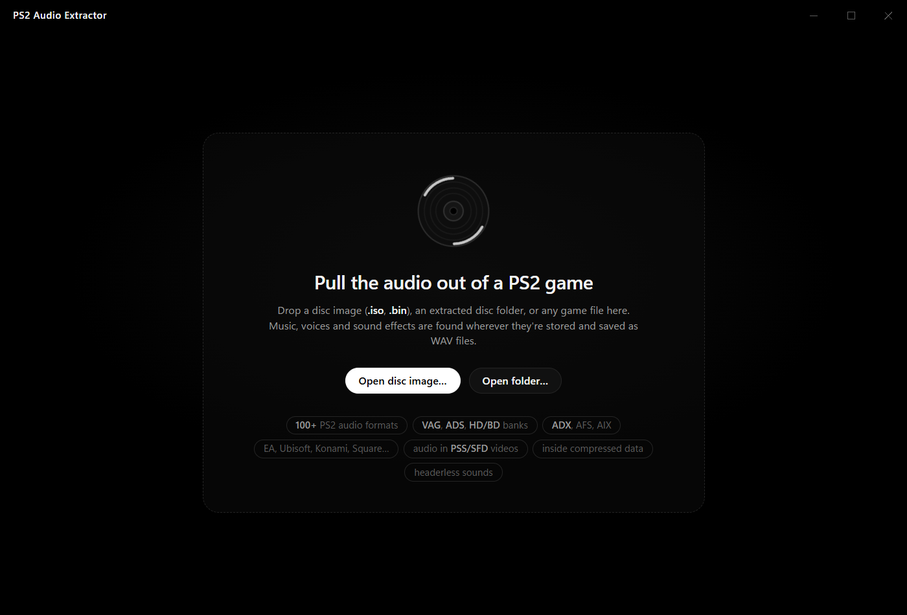
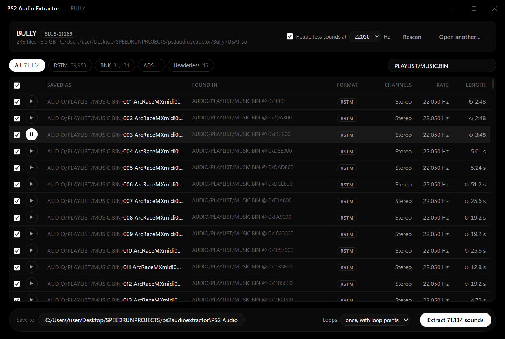
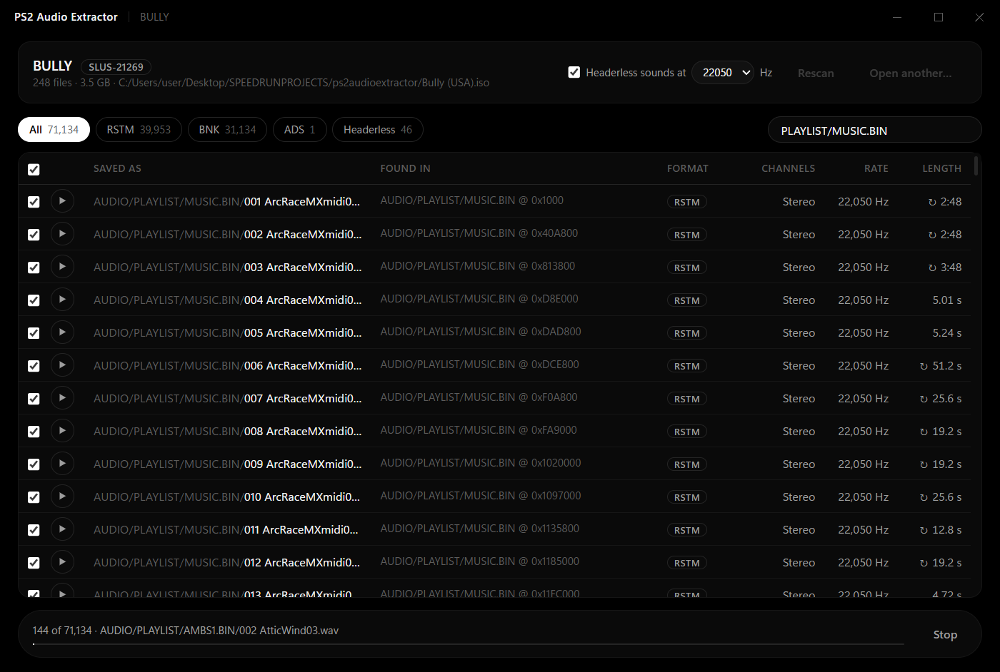

# PS2 Audio Extractor

Pulls every piece of audio out of a PS2 game and saves it as WAV files, in folders that
mirror where each sound was found on the disc.

Open a disc image or an extracted game folder, wait for the scan, pick what you want and
hit Extract. You can preview any track before saving it.







## Download

Grab the zip from the
[latest release](https://github.com/4574130823/PS2-Audio-Extractor/releases/latest),
unzip it and run `ps2audioextractor.exe`. No install needed. It uses the WebView2 runtime
that comes with Windows 10 and 11.

## What it handles

- Disc images: `.iso` (DVD games) and raw `.bin` (CD games, 2352-byte sectors). Extracted
  disc folders and single files work too.
- 110 PS2 audio formats, ported from [vgmstream](https://github.com/vgmstream/vgmstream):
  VAG, ADS/SShd, HD/BD banks, ADX (including encrypted ADX), AIX, FSB, Sony BNK, EA, Ubisoft,
  Konami, Square, Rockstar and a lot more. Decoded output matches vgmstream sample for sample.
- Sounds packed inside archives, found by signature wherever they are.
- Audio inside PSS and SFD videos.
- Audio inside zlib/gzip compressed data.
- Headerless PS-ADPCM (optional, you choose the sample rate).
- Left/right file pairs joined into one stereo track.
- Names stored in banks, and Bully's playlist names from its `.LST` files.

Looping tracks keep their loop points (a `smpl` chunk in the WAV), or can be written out
looped twice with a 10 second fade. A `tracks.csv` next to the output lists every track
with its source file, offset, format, rate, length and loop points.

## Building

Needs Rust (edition 2024) and, on Windows, the WebView2 runtime (already there on
Windows 10/11).

```
cargo build --release
```

The exe ends up in `target/release/ps2audioextractor.exe`.

## Command line

It also runs without the window:

```
ps2audioextractor <game> <output folder> [--loops-twice] [--no-headerless] [--headerless-rate N]
```

## Tests

`tools/` has Python scripts that build test files for every format and compare our output
against vgmstream's. Put a vgmstream release in `tools/vgmstream/` (so that
`tools/vgmstream/vgmstream-cli.exe` exists), do a debug build, then:

```
python tools/check_all.py
```

`cargo test` runs the unit tests.

## Not supported yet

- CHD images and `.cue` sheets (open the `.bin` instead)
- CD audio tracks
- A few codecs some formats can carry but PS2 games rarely use (GameCube DSP, ATRAC,
  MPEG). Those tracks show up in the list with a note instead of being extracted.

## License

MIT, see [LICENSE](LICENSE).

The format parsers and decoders follow vgmstream's source. Its license is in
[LICENSE-vgmstream](LICENSE-vgmstream).
